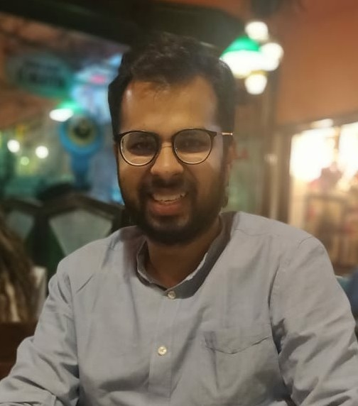

# Siddharth Goel 

Graduate student at **University of Pennsylvania** 

Program | Graduation Date | Resume
--- | --- | ---
[Masters in Data Science](https://dats.seas.upenn.edu/) | December, 2021 | [Click Here](https://github.com/LaughBuddha/LaughBuddha.github.io/blob/master/SiddhathGoel_UPenn_Summer2021.pdf)

**Areas of interest:** Data Science, Machine Learning, Deep Learning

### Technology, languages, tools
* **Programming Language:** Python
   - NumPy, pandas, scikit-learn, matplotlib, seaborn
* **Deep Learning framework:** PyTorch   
* SQL
* Apache Spark, PySpark
* Experience in working on **Amazon EC2** and **EMR** instances

### Research
Pursuing master's thesis in **Computer Vision/Perception in Robotics**

**Topic** - Navigation of agents in 3D indoor environments to acheive tasks such as point goal and object goal navigation.

**Advised by** - [Kostas Daniilidis](https://www.cis.upenn.edu/~kostas/)

Started in Jan 2021 and in the very initial stages of the research work. To get an idea of the problem statement please refer the following related works - [Active Neural SLAM](https://www.cs.cmu.edu/~dchaplot/projects/neural-slam.html) and [Semantic Exploration](https://www.cs.cmu.edu/~dchaplot/projects/semantic-exploration.html) by Chaplot et al. and [AI Habitat](https://aihabitat.org/).

Personal contributions to be updated soon.

### Projects
* **US Traffic Accidents** | *Predictive Analytics, Python, scikit-learn, matplotlib, seaborn, Spark* | [Github Repo](https://github.com/LaughBuddha/Predictive-Analytics/blob/master/US_Traffic_Accidents.ipynb)
  - Built the complete data science pipeline by performing extensive exploratory data analysis, data pre-processing, feature engineering, and data modelling on about 3 million records of the [US Traffic Accidents dataset](https://smoosavi.org/datasets/us_accidents).

* **Audio Source Separation** | *Deep Learning, PyTorch, Python* | [Github Repo](https://github.com/LaughBuddha/Audio-Source-Separation)
  - Separated [MUSDB18](https://sigsep.github.io/datasets/musdb.html#musdb18-compressed-stems) dataset mixture tracks into vocals, drums, bass, and other instruments using LSTM and state-of-the-art deep learning models.
   
### Courses taken at UPenn

Data Science | Deep Learning | NLP | Robotics
--- | --- | --- | ---
CIS 520: Machine Learning | CIS 522: Deep Learning for Data Science | CIS 530: Computational Linguistics | ESE 650: Learning in Robotics
ESE 542: Stastics for Data Science | ESE 546: Principles of Deep Learning |  |
CIS 545: Big Data Analytics |  |  |

**Teaching Assistant**

Course | Role | Semester
--- | --- | ---
ESE 545: Data Mining | TA/Grader | Spring 2020
ESE 542: Statistics for Data Science (Coursera) | Course Development Assistant | Fall 2020

### Fond of ...

Food & Drinks | Activities | Places | Animals 
--- | --- | --- | ---
Coffee | Swimming | Beaches | Elephants
Beer | Cycling | Mountains |
Wine | Reading |  |
Mexican | Cooking |  |
Pizza |  |  |

### Shows I liked

 Name | Genre | Platform
 ---- | ----- | --------
 The Last Dance | Sports (NBA) | Netflix
 Formula 1: Drive to Survive | Sports (F1) | Netflix
 The Test: A New Era for Australia's Team | Sports (Cricket) | Amazon Prime
 Free Solo | Sports (Rock Climbing) | Disney+
 The Dawn Wall | Sports (Rock Climbing) | Netflix
 The Final Table | Food | Netflix
 The World's Most Extraordinary Homes | Lifestyle | Netflix

### Personal Info

**Email:** [sigoel@seas.upenn.edu](mailto:sigoel@seas.upenn.edu)

**LinkedIn:** [linkedin.com/in/siddharth-goel-in](https://www.linkedin.com/in/siddharth-goel-in)
